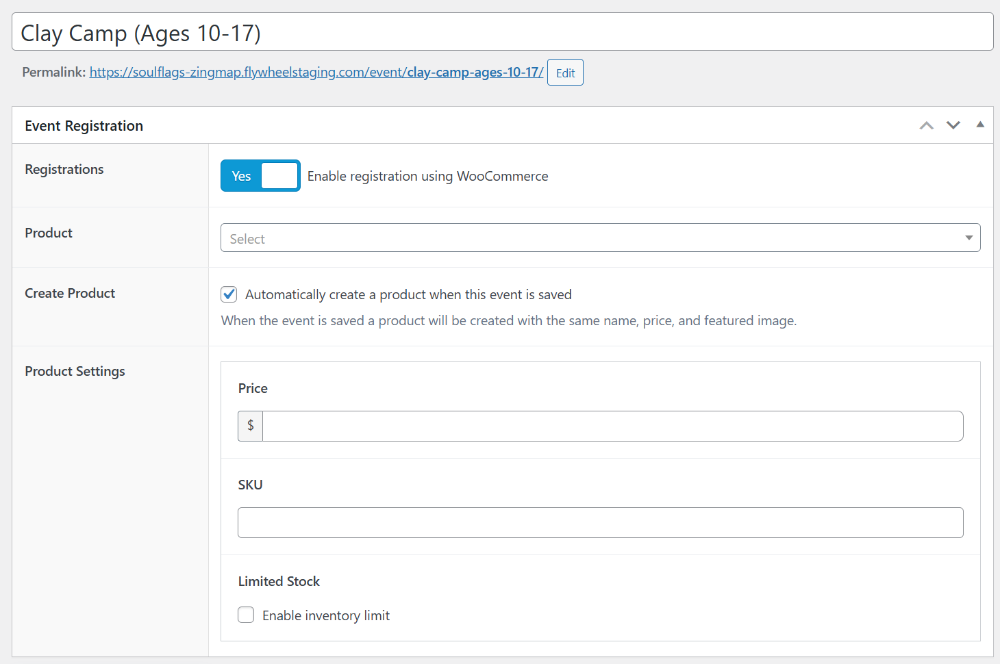
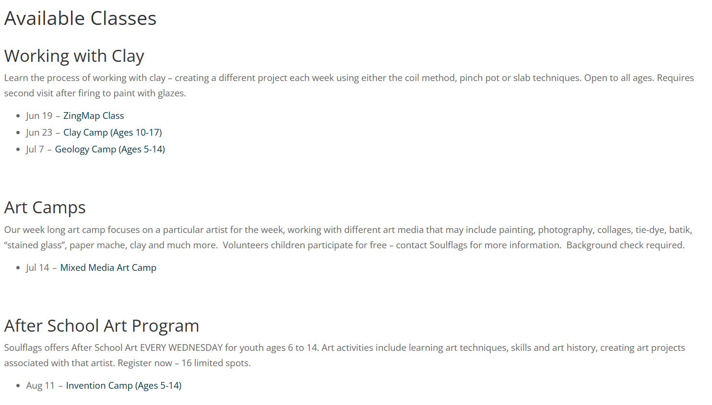

# Soulflags Events

Adds an integration between The Events Calendar and WooCommerce allowing you to enable registrations for an event, requiring you to purchase a WooCommerce product.

## Required Plugins

1. [WooCommerce](https://wordpress.org/plugins/woocommerce/)
2. [The Events Calendar](https://wordpress.org/plugins/the-events-calendar/)
3. [Advanced Custom Fields PRO](https://www.advancedcustomfields.com/pro/)

## How to Use

When creating or editing an event, you will see a new "Event Registration" section. Here you can select a WooCommerce product that will be required to register for the event.

You can also automatically create a product which will use the event title and featured image from the event. You can also provide the price, SKU, and enable stock management.

## Available Shortcodes

Use the shortcode `[souflags_list_classes]` to display a list of classes organized by Class Type.
Note that Class Type is a custom taxonomy associated with Events and is provided by this plugin.

Classes displayed using this shortcode are ordered by the next event and grouped by term.

## Changelog

### 1.1.6
- Improved Class Type archive pages and added back link to customizable Classes main page

### 1.1.5
- First release